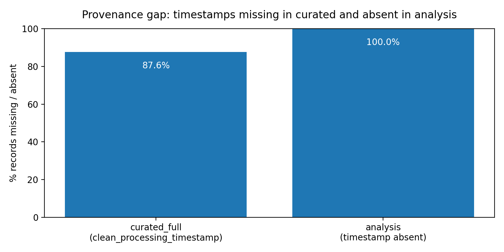

# Auditability & Provenance Study

This folder documents the **governance finding**: a material **auditability / provenance gap** caused by missing processing timestamps in the curated layer and the absence of timestamp fields in the analysis layer.

## Objective

Assess whether the dataset supports **auditability and provenance** (i.e., being able to trace _when_ and _how_ a record was processed), and quantify any gaps that weaken an audit trail (lineage, reproducibility, accountability).

---

## What we produced

- **Notebook (reproducible analysis):**  
  `auditability_provenance.ipynb`  
  https://github.com/msusanrocha/DEGO_Project_Group03/blob/main/data/governance/auditability_provenance_study/auditability_provenance.ipynb

- **Evidence (metrics table):**  
  `provenance_gap_summary_auditability.csv`  
  https://github.com/msusanrocha/DEGO_Project_Group03/blob/main/data/governance/auditability_provenance_study/provenance_gap_summary_auditability.csv

- **Figure:**  
  `provenance_gap.png`  
  https://github.com/msusanrocha/DEGO_Project_Group03/blob/main/data/governance/auditability_provenance_study/provenance_gap.png

---

## Process

1. **Loaded datasets**
   - `data/curated/applications_curated_full.csv` (curated layer, includes `raw_processing_timestamp` and `clean_processing_timestamp`)
   - `data/curated/applications_analysis.csv` (analysis/model dataset, does _not_ include processing timestamp fields)

2. **Profiled timestamp fields**
   - For `raw_processing_timestamp` and `clean_processing_timestamp` (in curated):
     - computed `missing_pct` (including empty strings)
     - checked parse validity (`parse_failed_pct`)
     - flagged “future” timestamps (`future_ts_pct`)
   - For the analysis dataset:
     - verified timestamp fields are **absent** (`has_field = 0`)

3. **Exported evidence + figure**
   - Saved the results table to `provenance_gap_summary_auditability.csv`
   - Created a bar chart (`provenance_gap.png`) comparing:
     - `% missing timestamp (curated_full)`
     - `timestamp absent (analysis)` as 100%

---

## Results

From `provenance_gap_summary_auditability.csv`:

### 1) Curated layer: timestamps mostly missing

- `applications_curated_full`:
  - `raw_processing_timestamp`: **440 / 502 missing = 87.65%**
  - `clean_processing_timestamp`: **440 / 502 missing = 87.65%**
  - `parse_failed_pct`: **0%** (not a formatting/parsing issue)
  - `future_ts_count`: **2 / 502 = 0.4%** (integrity anomaly: timestamps beyond “now”)

**Interpretation:**  
For ~9 in 10 records in curated, we cannot reliably answer: _“When was this record processed/cleaned?”_ This is a material audit trail gap.

### 2) Analysis layer: timestamps absent

- `applications_analysis`:
  - `processing_timestamp` is **absent** (`has_field = 0`)
  - `raw_processing_timestamp` / `clean_processing_timestamp` are also absent

**Interpretation:**  
Even if curated had full provenance, the analysis/model dataset does not carry timestamp metadata, reducing **reproducibility** and **accountability** for model training decisions.

---

## Why this matters

This is not a downstream “data cleaning” mistake; it points to a likely **upstream instrumentation/process deficiency**:

- missing event logging or ingestion metadata
- lack of enforced data contract rules for provenance fields
- incomplete lineage propagation from curated → analysis

Operationally, this affects:

- internal audits and regulatory queries (“show us how this record was processed”)
- dataset versioning and reproducibility of model results
- incident response (harder to trace when/where a problematic record entered the pipeline)

---

## GDPR connection

Even though the GDPR does not mandate a specific field like `processing_timestamp`, auditability and traceability are essential to **demonstrate compliance** and manage risk in personal data processing:

### GDPR Article 5(2) — Accountability

Controllers must be able to **demonstrate compliance** with GDPR principles (“accountability”).  
Link: https://gdpr-info.eu/art-5-gdpr/

**Connection:** Without provenance metadata (timestamps, run IDs, dataset versions), demonstrating compliance and reconstructing processing becomes materially harder.

### GDPR Article 24 — Responsibility of the controller

Controllers must implement measures to ensure and be able to demonstrate processing is performed in accordance with GDPR.  
Link: https://gdpr-info.eu/art-24-gdpr/

**Connection:** Provenance controls (logging, lineage, versioning) are practical “technical and organisational measures” that enable proof and governance.

### GDPR Article 25 — Data protection by design and by default

Requires embedding privacy controls into systems by design.  
Link: https://gdpr-info.eu/art-25-gdpr/

**Connection:** “By design” implies building a pipeline where processing is traceable (audit trail), not a best-effort afterthought.

### GDPR Article 30 — Records of processing activities

Requires maintaining records of processing activities (RoPA).  
Link: https://gdpr-info.eu/art-30-gdpr/

**Connection:** Dataset-level lineage and run manifests complement RoPA by linking documented processing to verifiable pipeline executions (operational evidence).

### GDPR Article 32 — Security of processing

Requires appropriate security measures considering risks.  
Link: https://gdpr-info.eu/art-32-gdpr/

**Connection:** Audit trails/logs help detect anomalies (e.g., “future timestamps”), support integrity monitoring, and improve incident investigation.

---

## Recommendations (controls to close the gap)

1. **Mandatory provenance fields in curated** (Owner: Data Engineering)
   - Enforce `clean_processing_timestamp` as NOT NULL + must not be in the future.
   - Add `pipeline_run_id`, `dataset_version`, and `source_snapshot_hash`.

2. **Propagate lineage to analysis layer** (Owner: Data Engineering + Data Science)
   - Include `dataset_version` and `pipeline_run_id` in `applications_analysis.csv` (minimal lineage).
   - Optional: include `clean_processing_timestamp` for audit-only (not a modeling feature).

3. **Data contract enforcement in CI** (Owner: Data Engineering + Governance)
   - Fail pipeline if provenance coverage < threshold.
   - Suggested KPI: `non_null(clean_processing_timestamp) >= 99.5%` (warning) and `< 98%` (block deploy).

4. **Run manifest + access logging** (Owner: Governance / Security)
   - Store an execution manifest per pipeline run (inputs, outputs, rule versions, counts).
   - Log access to curated datasets containing PII.

---

## How to reproduce

1. Open `auditability_provenance.ipynb`
2. Run all cells
3. Outputs (in this folder):
   - `provenance_gap_summary_auditability.csv`
   - `provenance_gap.png`

---

## Reference: GDPR legal text (official)

Regulation (EU) 2016/679 (GDPR) — EUR-Lex:  
https://eur-lex.europa.eu/eli/reg/2016/679/oj/eng
